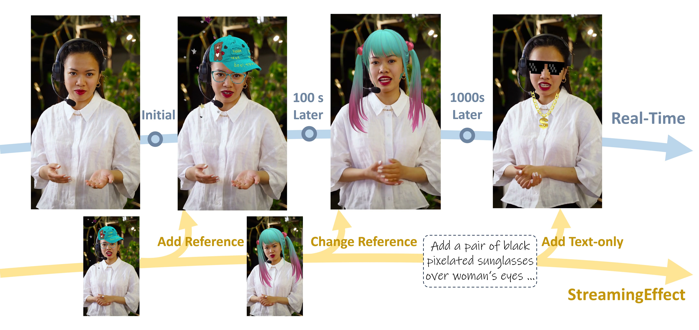

# StreamingEffect: Real-Time Human-Centric Video Effect Generation

**Yiren Song, Cheng Liu, Yuxin Jiang, Mike Zheng Shou**

[](https://arxiv.org/abs/XXXX.XXXXX)
[](https://huggingface.co/datasets/lc03lc/VideoEffect-130K)
[](https://huggingface.co/lc03lc/StreamingEffect)

---



<!-- **(a) Bidirectional Teacher Training:** A bidirectional teacher is trained with reference-conditioned in-context video editing. **(b) Causal Student Distillation:** The teacher is distilled into a causal autoregressive student for streaming generation. **(c) Sliding-window Autoregressive Inference:** The student edits incoming video chunks online with cached context and propagates effects through the stream.* -->

---

## Introduction

**StreamingEffect** is a real-time human-centric streaming video effect framework. Given an incoming video stream, it continuously applies expressive visual effects (accessories, makeup, stylization, atmospheric overlays, etc.) while preserving human identity, background content, and temporal consistency.

Key features:
- **Real-time 720p inference** on a single H200 GPU (14.1 FPS)
- **Reference-conditioned control**: inject a keyframe image to guide the effect style
- **Text-driven control**: describe effects with natural language
- **Interactive switching**: change reference image or text prompt on the fly during streaming
- Built on [Wan2.2-TI2V-5B](https://huggingface.co/Wan-AI/Wan2.2-TI2V-5B-Diffusers) with two-stage distillation

## Installation

```bash
git clone https://github.com/showlab/StreamingEffect.git
cd StreamingEffect

# Create conda environment
conda create -n streaming_effect python=3.10
conda activate streaming_effect

# Install PyTorch (adjust CUDA version as needed)
pip install torch torchvision --index-url https://download.pytorch.org/whl/cu128

# Install dependencies
pip install diffusers transformers accelerate
pip install decord pillow numpy
pip install einops omegaconf

# Install the fastgen package (for Stage 1 & 2)
pip install -e .
```

## Models

Pre-trained checkpoints are available on HuggingFace:

| Stage | Description | Checkpoint |
|-------|-------------|------------|
| Teacher (Stage 0) | Bidirectional teacher, 50-step, highest quality | [stage0.ckpt](https://huggingface.co/lc03lc/StreamingEffect/blob/main/stage0.ckpt) |
| Stage 1 | Causal AR student, 50-step streaming | [stage1.ckpt](https://huggingface.co/lc03lc/StreamingEffect/blob/main/stage1.ckpt) |
| Stage 2 | Self-Forcing student, 4-step real-time | [stage2.ckpt](https://huggingface.co/lc03lc/StreamingEffect/blob/main/stage2.ckpt) |

Download with:
```bash
huggingface-cli download lc03lc/StreamingEffect --local-dir ./checkpoints
```

The backbone model (Wan2.2-TI2V-5B-Diffusers) will be automatically downloaded from HuggingFace on first run, or you can pre-download it:
```bash
huggingface-cli download Wan-AI/Wan2.2-TI2V-5B-Diffusers --local-dir ./models/Wan2.2-TI2V-5B-Diffusers
```

## Dataset

**VideoEffect-130K** is available on HuggingFace:

[](https://huggingface.co/datasets/lc03lc/VideoEffect-130K)

The dataset contains ~130K paired human-centric videos:
- **70K effect-rendering samples**: accessories, headwear, makeup, atmosphere overlays, style filters across 600+ categories
- **60K general-editing samples**: object manipulation, background editing, style transfer, etc.

Each sample is a triplet: `(source_video, reference_image, target_video)`.

## Inference

### Stage 2 (Real-time, recommended)

```bash
# Single GPU — image-guided (provide reference PNG)
python infer_stage2.py \
    --ckpt_path ./checkpoints/stage2.ckpt \
    --testset /path/to/testset \
    --output_dir ./outputs/stage2 \
    --max_side 1088

# Multi-GPU (4 GPUs)
CUDA_VISIBLE_DEVICES=0,1,2,3 torchrun --nproc_per_node=4 infer_stage2.py \
    --ckpt_path ./checkpoints/stage2.ckpt \
    --testset /path/to/testset \
    --output_dir ./outputs/stage2 \
    --max_side 1088

# Enable CFG (higher quality, slightly slower)
python infer_stage2.py \
    --ckpt_path ./checkpoints/stage2.ckpt \
    --testset /path/to/testset \
    --output_dir ./outputs/stage2_cfg \
    --guidance_scale 5.0 \
    --max_side 1088
```

**Test set format:** Each sample consists of `{stem}.mp4` (first half = source video, second half = GT), `{stem}.txt` (text prompt), and optionally `{stem}.png` (reference effect image).

### Stage 1 (50-step streaming)

```bash
python infer_stage1.py \
    --ckpt_path ./checkpoints/stage1.ckpt \
    --testset /path/to/testset \
    --output_dir ./outputs/stage1 \
    --num_steps 50 \
    --max_side 1088
```

### Teacher (50-step, highest quality, offline)

```bash
# Set CKPT in infer_teacher.sh, then:
CKPT=./checkpoints/stage0.ckpt bash infer_teacher.sh
```

## Training

Training proceeds in three stages. Each stage builds on the previous one.

### Prerequisites

1. Download the Wan2.2-TI2V-5B-Diffusers backbone model.
2. Download VideoEffect-130K and set `dataset_roots` in `configs/train_teacher.yaml`.

### Stage 0: Bidirectional Teacher

Trains a high-quality bidirectional teacher with LoRA on 8 GPUs:

```bash
CUDA_VISIBLE_DEVICES=0,1,2,3,4,5,6,7 bash train_teacher.sh
```

Key hyperparameters (edit `configs/train_teacher.yaml`):
- `training.max_steps`: 8000
- `training.learning_rate`: 1e-4
- `dataset.max_long_side`: 1088

### Stage 1: Causal SFT (Bidirectional → Causal)

Converts the teacher into a causal autoregressive student with KV caching:

```bash
# First merge teacher LoRA weights into a single .pt file
# (see scripts/merge_lora.py)
MERGED_MODEL=/path/to/merged_transformer.pt bash train_stage1.sh
```

Key hyperparameters:
- 3,000 iterations, batch size 4 × 8 GPUs
- Learning rate: 5e-5, CFG scale: 5.0

### Stage 2: Self-Forcing (4-step distillation)

Distills the Stage 1 student into a 4-step real-time model using on-policy rollouts:

```bash
# First merge Stage 1 FSDP checkpoint (see scripts/convert_fsdp_checkpoint.py)
TEACHER_CKPT=/path/to/merged_transformer.pt \
STUDENT_CKPT=/path/to/stage1_net_iter3000.pt \
bash train_stage2.sh
```

Key hyperparameters:
- 3,000 iterations, batch size 4 × 8 GPUs
- Learning rate: 1e-6
- 4-step schedule: `[0.999, 0.937, 0.833, 0.624, 0.0]`

## Citation

```bibtex
@inproceedings{song2026streamingeffect,
  title     = {StreamingEffect: Real-Time Human-Centric Video Effect Generation},
  author    = {Song, Yiren and Liu, Cheng and Jiang, Yuxin and Shou, Mike Zheng},
  booktitle = {Advances in Neural Information Processing Systems},
  year      = {2026}
}
```

## Acknowledgements

This project builds on [Wan2.2](https://github.com/Wan-Video/Wan2.1) by Alibaba and [Fastgen](https://github.com/NVlabs/FastGen) by Nvidia. We thank the authors for open-sourcing their work.
